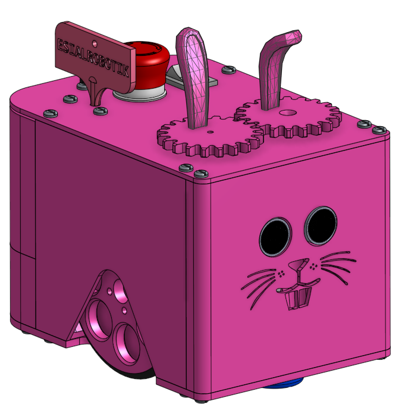
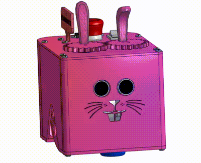

# Vue d'ensemble d'un PAMI

PAMI = Petit Actionneur Motorisé Indépendant

# Liste des pièces

| Pièce | Fichier | Commentaire |
| - | - | - |
| Châssis | [pami_base_roulante.3mf](pami_base_roulante.3mf) | |
| Face avant | [pami_front_museau.3mf](pami_front_museau.3mf) | Prévoir 4 inserts laiton M3 |
| Côté gauche | [pami_side_gauche.3mf](pami_side_gauche.3mf) | Prévoir 4 inserts laiton M3 |
| Côté droit | [pami_side_droit.3mf](pami_side_droit.3mf) | Prévoir 4 inserts laiton M3 |
| Coffre fixe | [pami_back.3mf](pami_back.3mf) | Prévoir 2 inserts laiton M3 |
| Coffre amovible | [pami_trunk.3mf](pami_trunk.3mf) | Prévoir 2 aimants neodyme dimaètre 8mm épaisseur 3mm |
| Toit | [pami_top.3mf](pami_top.3mf) | Prévoir 2 aimants neodyme dimaètre 8mm épaisseur 3mm |
| Roue | [pami_roue.3mf](pami_roue.3mf) | |
| Support microswitch tirette | [pami_cord_microswitch_holder.3mf](pami_cord_microswitch_holder.3mf) | |
| Oreille droite servo | [pami_ear_servo.3mf](pami_ear_servo.3mf) | |
| Oreille gauche libre | [pami_ear_free.3mf](pami_ear_free.3mf) | |

# Autres ressources

Museau de la face avant : [pami1.svg](pami1.svg)
